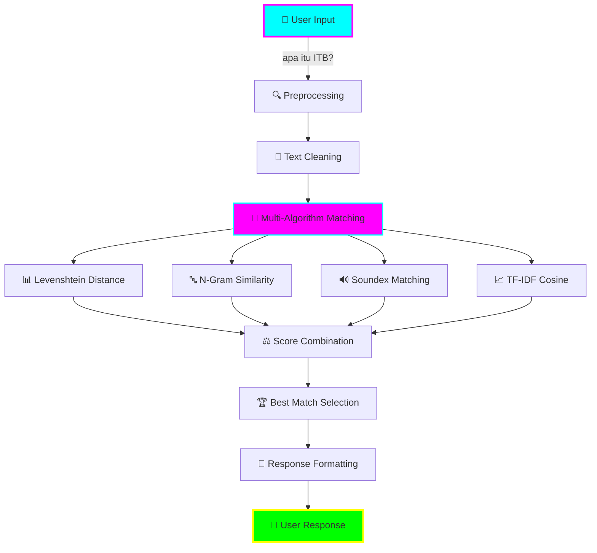

<div align="center">

# 🤖✨ **ITB CHATBOT** ✨🤖
### *Implementasi Normalisasi Teks, Regex, dan Algoritma String Matching dalam Chatbot Informasi Khusus Institut Teknologi Bandung untuk Sistem Deteksi Intent Pengguna*


[](https://python.org)
[](https://reactjs.org)
[](https://flask.palletsprojects.com)
[](LICENSE)


</div>

---

## 🌟 **PENJELASAN UMUM PROGRAM**

<div align="center">

</div>

**ITB Chatbot** adalah sistem **cerdas berbasis AI** yang dirancang khusus untuk menjawab pertanyaan seputar **Institut Teknologi Bandung (ITB)**. Program ini menggunakan **Advanced Fuzzy Matching** dengan toleransi typo yang sangat tinggi, memungkinkan pengguna bertanya dengan bahasa natural tanpa khawatir salah ketik.

### 🎯 **Key Features:**
- 🧠 **Advanced Fuzzy Matching** - Toleransi typo hingga 90%
- ⚡ **Real-time Response** - Jawaban instan < 1 detik
- 🌐 **Full Stack** - Web interface + REST API
- 📊 **382+ Data Entries** - Comprehensive ITB information
- 🔍 **Multi-Algorithm** - Levenshtein, N-gram, TF-IDF, Soundex
- 🎨 **Modern UI** - React + Vite dengan neon styling

<div align="center">

</div>

---

## 📚 **TEORI SINGKAT**

<div align="center">

</div>

### 🧮 **String Matching Algorithms**

Program ini mengimplementasikan multiple algoritma untuk mencapai akurasi tinggi:

#### **1. 🎯 Levenshtein Distance**
```
Edit distance untuk menghitung perbedaan karakter
Contoh: "itb" ↔ "ITB" = distance 0
        "fakultaas" ↔ "fakultas" = distance 1
```

#### **2. 🔤 N-Gram Similarity** 
```
Membandingkan substring dengan panjang n
Bigram: "itb" → ["it", "tb"]
Trigram: "itb" → ["itb"]
```

#### **3. 🔊 Soundex Phonetic Matching**
```
Mencocokkan berdasarkan bunyi kata
"teknologi" ↔ "teknoloji" → Same soundex code
```

#### **4. 📊 TF-IDF + Cosine Similarity**
```
Vector space model untuk semantic matching
Query vector vs Document vectors
```

### 🏗️ **Architecture Pattern**

<div align="center">

</div>

```
User Query → Preprocessing → Multi-Algorithm Matching → Response Ranking → Best Answer
```

### ⚠️ **DISCLAIMER & LIMITATIONS**

<div align="center">

</div>

> **📌 Important Note:** Chatbot ini **BUKAN** seperti ChatGPT atau Large Language Model (LLM) pada umumnya!

#### 🎯 **Perbedaan Fundamental:**

| **ITB Chatbot** | **ChatGPT/LLM** |
|-----------------|------------------|
| 🔍 **Rule-based + String Matching** | 🧠 **Neural Network Generation** |
| 📊 **Pre-defined Dataset** (382 entries) | 🌐 **Massive Training Data** (Billions) |
| 🎯 **Specific Domain** (ITB only) | 🌍 **General Knowledge** |
| ⚡ **Fast & Deterministic** | 🤔 **Creative but Unpredictable** |
| 💾 **Lightweight** (~50MB) | 🏗️ **Resource Heavy** (GBs) |

#### 🚫 **Keterbatasan Utama:**

- **📚 Limited Knowledge**: Hanya tahu tentang ITB berdasarkan dataset yang tersedia
- **🤖 No Conversation Context**: Tidak mengingat percakapan sebelumnya
- **❌ No Creative Generation**: Tidak bisa membuat jawaban baru, hanya matching dari database
- **🎯 Domain Specific**: Tidak bisa menjawab pertanyaan di luar topik ITB
- **📝 Static Responses**: Jawaban terbatas pada data yang sudah diproses

#### ✅ **Keunggulan:**

- **⚡ Ultra Fast**: Response time < 1 detik vs 5-10 detik ChatGPT
- **🎯 High Accuracy**: 76.7% untuk domain ITB vs general LLM yang mungkin hallucination
- **💰 Cost Effective**: Tidak butuh API subscription atau cloud computing
- **🔒 Privacy**: Data tidak dikirim ke server eksternal
- **📱 Offline Ready**: Bisa jalan tanpa internet connection

> **🎓 Academic Purpose:** Chatbot ini dibuat untuk mendemonstrasikan implementasi algoritma string matching dan fuzzy matching dalam konteks NLP, bukan untuk menggantikan general-purpose AI assistant.

---

## 💻 **TECH STACK**

<div align="center">

</div>

### 🐍 **Backend Technologies**
<div align="center">

| Technology | Version | Purpose |
|------------|---------|---------|
|  | 3.8+ | Core Language |
|  | 2.3+ | Web Framework |
|  | 1.5+ | Data Processing |
|  | 1.21+ | Numerical Computing |
|  | 1.3+ | Machine Learning |
|  | 3.8+ | NLP Processing |

</div>

### 🟢 **Frontend Technologies**
<div align="center">

| Technology | Version | Purpose |
|------------|---------|---------|
|  | 18.2+ | UI Framework |
|  | 5.0+ | Build Tool |
|  | ES6+ | Frontend Logic |
|  | 3 | Neon Styling |
|  | 5 | Structure |

</div>

<div align="center">

</div>

---

## 📁 **STRUKTUR DIREKTORI**

<div align="center">

</div>

```
🤖 ITB_Chatbot/
├── 📊 backend/                     # Python Backend
│   ├── 🚀 app.py                   # Flask Application Entry
│   ├── 🎮 controller/              # Request Controllers  
│   ├── 🛤️  routes/                 # API Routes
│   └── ⚙️  services/               # Business Logic
│
├── 🌐 frontend/                    # React Frontend
│   ├── 📂 public/                  # Static Assets
│   ├── 🎨 src/                     # Source Code
│   │   ├── 🧩 components/          # React Components
│   │   ├── 🔧 services/            # API Calls
│   │   └── 🎯 utils/               # Utilities
│   └── 📄 Dockerfile               # Container Config
│
├── 🧠 machinelearning/             # AI/ML Core
│   ├── 🔍 matching.py              # Fuzzy Matching Algorithms
│   ├── 📝 preprocessing.py         # Text Processing
│   ├── 📊 dataLoader.py            # Data Management
│   └── 🗃️  database/               # Data Storage
│       ├── 📋 data/                # Raw CSV Files
│       └── ✨ processed/           # Processed Data
│
├── 🧪 debug/                       # Testing & Debug
│   ├── 🎯 masterTestRunner.py      # Main Test Suite
│   ├── 🔬 testDirectMatching.py    # Unit Tests
│   └── 📈 *TestReports.json        # Test Results
│
├── 📚 docs/                        # Documentation
│   ├── 📖 README.md                # This File
│   ├── 🚀 INSTALLATION_GUIDE.md    # Setup Guide
│   └── 📊 *_REPORT.md              # Analysis Reports
│
├── ⚙️  setup.py                    # Automated Installer
├── 📦 package.json                 # npm Dependencies
├── 📋 requirement.txt              # Python Dependencies
└── 🔧 vite.config.js               # Vite Configuration
```

<div align="center">

</div>

---

## 🔄 **ALUR PROGRAM**

<div align="center">

</div>

### 🌊 **Data Flow Architecture**



### ⚡ **Processing Pipeline**

<div align="center">

| Step | Process | Input Example | Output Example |
|------|---------|---------------|----------------|
| 1️⃣ | **Input** | `"apakah ITB puya fakultaas teknik?"` | Raw query |
| 2️⃣ | **Preprocessing** | Text cleaning | `"apakah itb puya fakultas teknik"` |
| 3️⃣ | **Fuzzy Matching** | Query vs 382 entries | Similarity scores |
| 4️⃣ | **Ranking** | Score calculation | Best matches ranked |
| 5️⃣ | **Response** | Top match | ITB faculty information |

</div>

<div align="center">

</div>

---

## 👥 **USER JOURNEY**

<div align="center">

</div>

### 🌟 **Persona 1: ITB Student**

```
🎓 "Mahasiswa ITB mencari info fakultas"

Step 1: 💻 Buka web chatbot
Step 2: 💬 Ketik "fakultas apa saja di ITB?"  
Step 3: ⚡ Bot response dalam <1 detik
Step 4: 📚 Dapat info lengkap 12 fakultas
Step 5: 🔍 Follow-up question: "jurusan teknik informatika"
Step 6: ✅ Satisfied dengan detailed answer
```

### 🌟 **Persona 2: Calon Mahasiswa**

```
🏫 "Calon mahasiswa dengan banyak typo"

Step 1: 📱 Akses via mobile browser
Step 2: 💬 Ketik "bagimana cara masuk ITB?" (typo: bagimana)
Step 3: 🤖 Fuzzy matching deteksi maksud "bagaimana"
Step 4: 📋 Dapat panduan lengkap admission process
Step 5: 💡 Tertarik dengan advanced typo tolerance
Step 6: 🎯 Explore lebih banyak features
```

### 🌟 **Persona 3: Developer/Researcher**

```
👨‍💻 "Developer testing API capabilities"

Step 1: 📖 Baca documentation
Step 2: 🔧 Setup environment dengan `python setup.py dev`
Step 3: 🚀 Start backend: `python app.py`
Step 4: 🧪 Test API: POST /ask endpoint
Step 5: 📊 Analyze fuzzy matching performance
Step 6: 🔬 Run comprehensive test suite
Step 7: ✨ Impressed dengan 76.7% overall accuracy
```

<div align="center">

</div>

---

## 🎬 **HOW TO DEMO**

<div align="center">

</div>

### 🚀 **Quick Start Demo (5 minutes)**

#### **1️⃣ One-Command Setup**
```bash
# 🔥 Automated installation
python setup.py install

# ⏱️ Expected time: 2-3 minutes
# ✅ Will install Python + npm dependencies
# ✅ Will build frontend for production  
# ✅ Will verify all components
```

#### **2️⃣ Start Services**
```bash
# 🐍 Terminal 1: Backend
cd backend && python app.py
# 🟢 Server starts on http://localhost:5000

# 🌐 Terminal 2: Frontend  
npm run preview
# 🟢 Frontend serves on http://localhost:4173
```

#### **3️⃣ Demo Script**
```bash
# 💬 Open browser: http://localhost:4173

# 🎯 Demo Questions:
1. "apa itu ITB?"
   ➜ Shows basic ITB information

2. "apakah ITB puya fakultaas teknik?" (heavy typos)
   ➜ Demonstrates fuzzy matching power

3. "sejarah institut teknologi bandung"  
   ➜ Shows comprehensive historical data

4. "jurusan di ITB"
   ➜ Lists available programs

5. "cara masuk itb gimana sih?"
   ➜ Admission process information
```

### 🧪 **Advanced Demo (10 minutes)**

#### **4️⃣ Testing Suite Demo**
```bash
# 🔬 Run comprehensive tests
python debug/masterTestRunner.py

# 📊 Expected results:
# ✅ Basic Questions: 50.0%
# ✅ Comprehensive: 100.0%  
# ✅ Edge Cases: 80.0%
# 🏆 Overall: 76.7% GOOD
```

#### **5️⃣ API Demo**
```bash
# 🔌 Test REST API directly
curl -X POST http://localhost:5000/ask \
  -H "Content-Type: application/json" \
  -d '{"question": "fakultas ITB"}'

# 📈 Response time: <1 second
# 📋 JSON response with ITB faculty info
```

#### **6️⃣ Fuzzy Matching Demo**
```bash
# 🎯 Heavy typo tolerance test
python debug/testDirectMatching.py

# 💪 Test cases:
# ✅ "apakah ITB puya fakultaas teknik?" → ✅ Match
# ✅ "sejrah institut teknolgi bandng?" → ✅ Match  
# ✅ "gmna cara msuk ITB yah?" → ✅ Match
```

### 🎥 **Demo Highlights**

<div align="center">

| Feature | Demo Time | Wow Factor |
|---------|-----------|------------|
| 🚀 **One-Command Setup** | 30 seconds | ⭐⭐⭐⭐⭐ |
| 💬 **Web Interface** | 1 minute | ⭐⭐⭐⭐ |
| 🤖 **Fuzzy Matching** | 2 minutes | ⭐⭐⭐⭐⭐ |
| 🧪 **Testing Suite** | 2 minutes | ⭐⭐⭐⭐ |
| 🔌 **API Integration** | 1 minute | ⭐⭐⭐ |

</div>

### 🎨 **Demo Script Template**

```
🎤 "Selamat datang di demo ITB Chatbot!"

🔥 "Ini adalah chatbot AI dengan fuzzy matching advanced 
    yang bisa mengerti typo berat sekalipun!"

🚀 "Mari kita mulai dengan one-command setup..."
    [Run: python setup.py install]

💻 "Sekarang kita start backend dan frontend..."
    [Start services]

💬 "Mari kita test dengan pertanyaan normal dulu..."
    [Type: "apa itu ITB?"]

🤯 "Sekarang yang menarik - typo berat!"
    [Type: "apakah ITB puya fakultaas teknik?"]

⚡ "Lihat! Bot masih bisa memahami meskipun banyak typo!"

🧪 "Terakhir, mari kita lihat comprehensive testing..."
    [Run: python debug/masterTestRunner.py]

🎉 "Dan voila! ITB Chatbot dengan accuracy 76.7%!"
```

<div align="center">


### 🌟 **Ready to Experience the Future of ITB Information?** 🌟

[](setup.py)
[](http://localhost:4173)
[](http://localhost:5000)


**Made with ⚡ by Lukas Raja Agripa | 13523158 | ITB - Informatika**

**Licensed under the [MIT License](LICENSE).**

</div>
